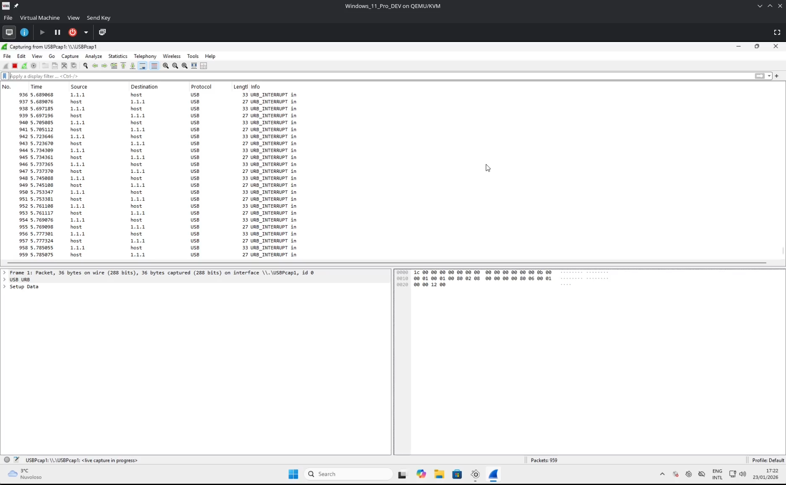

# Add the support to a new device

Hello and welcome to this (hopefully) helpful guide. I will try to guide you through the process of reverse engineering the Arctis device, and to write the configuration file required to support it in the Linux Arctis Manager application!

## Prerequisites

- Windows machine (can be either physical or virtual. I did the reverse engineering on a virtual machine)
- SteelSeries GG software installed on the Windows machine
- Your Arctis device (of course)

## Where configuration files are stored
Usually device configuration files are in the module's package. The application though accepts some other places, to facilitate the support of new devices.

In particular we're going to focus on two different folders:

- `~/.config/arctis_manager/devices` for device configuration files
- `~/.config/arctis_manager/lang` for language files

In order to reload the configurations, you can either restart the service (`systemd --user restart arctis-manager`), or calling the config reload Dbus method.

Every time you add a new configuration for the first time though, you'll need to run `lam-cli udev write-rules --force --reload` to write and reload the udev rules (this will prompt you for your sudoer password).

## Wireshark tutorial

First things first, take a look at the video below on YouTube, as it describes how to use Wireshark and interact with the SteelSeries GG software to get the required packets, from a general point of view. Don't worry to track packets down during the first view, as we're going to go down the rabbit's hole in a bit.

[](https://www.youtube.com/watch?v=zWbdnHwTr3M)

## The configuration file

Please take a look at the [specs docs](device_configuration_file_specs.md) to get glimpses on how a configuration file looks like.

### A few easy fields

- `name`: the friendly name of the device, for example: "SteelSeries Arctis Nova Pro Wireless"
- `vendor_id`: the vendor identifier. Should always be 0x1038, but you never know
- `product_ids`: the list of different product identifiers. Can be more than one in case of different SKUs, but actually same product.
- `command_padding`: see below

For all of these fields, you can either analyze the wireshark captured packets, or guess them via the `lam-cli tools arctis-devices` tool. This will show you the list of SteelSeries USB connected devices and the relative HID interfaces and endpoints. The tool needs to run on your Linux box.

```bash
❯ lam-cli tools arctis-devices 
SteelSeries Arctis Nova Pro Wireless (1038:12e0)
        Configuration: 1
                HID interface (num : alt): 3 : 0
                        Endpoint: 83 Dir=IN Type=Interrupt MaxPacketSize=2 
                HID interface (num : alt): 4 : 0
                        Endpoint: 84 Dir=IN Type=Interrupt MaxPacketSize=64 
                        Endpoint: 04 Dir=OUT Type=Interrupt MaxPacketSize=64
```

In this example we can see the "SteelSeries Arctis Nova Pro Wireless" (`name`), with its vendor:product identifiers (`vendor_id` and `product_ids`, or at least one of them).

Then we see two different HID interfaces (3 and 4, both with alternate setting 0):

- The first one is half pipe (IN) only, and accepts a packet size of maximum 2 bytes --> this is not what we're looking for, as commands and information usually need more than 2 bytes.
- The second one is full pipe (IN and OUT), and both have a max packet size of 64 bytes. Bingo!

Summarizing everything, this is how the device config file will start:
```yaml
device:
  name: SteelSeries Arctis Nova Pro Wireless
  vendor_id: 0x1038
  product_ids: [0x12e0] # This device actually has also a variant, for the purposes of the tutorial we'll keep it with experimental information only.
  command_padding:
    length: 64 # MaxPacketSize
    position: end # Just a guess (zeros padding the right part of the message). Will be confirmed looking at the packets in Wireshark.
    filler: 0x00 # Just a guess (usually it's zero-padded, but you never know when reverse engineering!)
  command_interface_index: [4, 0] # Interface number, interface alternate setting
  listen_interface_indexes: [4] # there is only one OUT endpoint with enough bytes to listen on
```

### device_init (first wave)

Some devices have a burst of messages being sent by the host (the software) to setup the device. The aim of these messages are to set the advanced capabilities (for example the ANC feature levels), as these devices don't usually have a persistent memory, and thus need to set things up at each startup.

In order to get these packets, you'll need to use Wireshark on Windows and, as decribed by the tutorial, get all the initial packages sent by the host to the device.

As a first step, to be refined in a later stage, you'll get those packets and write them in the `device_init` section. You won't have the grasp on what they mean, but some of them will be decoded at a later stage (i.e. when you'll understand what the values represent with the settings).

In my case, I started initializing the device with "raw" packets, then I understood that some commands were relative to the settings, and thus I replaced the static value bytes with the relative setting ones.

In order to call the value of a setting, instead of using a byte number, you can specify `'settings.SETTING_NAME'`, with the setting name as defined in the relative section. Another message that should be sent at the device's initialization is the status request. This is represented by the special message `['status.request']`. If no init is required, I'd at least call this one, to immediately refresh the status of the device in the application.

You'll notice that some messages will get responses back, and typically the host-sent messages will be empty but a few bytes: these are the requests messages, and one of them will be the status request one. Again, you'll understand which command is understanding the response. More on this later, I promise.

### status and status_parse

Once you get the grasp on which command sequence requests the status, you need to define:

- The list of device states
- How to parse them

For the first, you can cheat by reading the source of the [Sapd's HeadsetControl project](https://github.com/Sapd/HeadsetControl/blob/master/lib/devices/steelseries_arctis_pro_wireless.hpp), if you're lucky enough that the app supports your device. This gave me the kickstart I needed to refine my findings. Don't take for granted the code is correct, as it's the result of reverse engineering.

Most of the states are represented by linear sequences, starting from 0x00 or 0x01 up to the maximum value. For example, you can plug a fully charged battery and see a value of 0x08 --> this means that the battery status might have up to 9 different states (0x00 -> 0x08).

The status section is made of two items: the already discussed request sequence, to get the status of the device, and the status mapping part. The latter is a list of objects with: `starts_with` and the list of states. This is because the headset might send on the same endpoint different messages. Typically on the Arctis Nova Pro, when you send the status request message (0x06b0), you get a message starting with 0x06b0, with most of the states. At the same time, the device will also send messages with different header (in the particular case at least 0x0725 for the volume and 0x0745 for the channels mix), and these messages will have different headers, and the offset values will mean differently.

The status parse section is described in details in the specs documentation, with the (currently) supported types. If a new type of setting requires support, a PR is required to be done.

### settings

This section is notably easier to write, as the reverse engineering is straight forward: change the setting, read the message (host to device), and understand what's the fixed (setting's identifier) and what's the variable part (setting's value) of the message.

For example, you might want to add the support for the sidetone setting. Let's say that you have four possible different values: off, low, medium and high.

Example chart of setting and relative message (host to device)

|Setting change     |Message|
|-------------------|-------|
|From off to low    |0x62be**01**000000...|
|From low to off    |0x62be**00**000000...|
|From off to low    |0x62be**01**000000...|
|From low to medium |0x62be**02**000000...|
|From medium to high|0x62be**03**000000...|

Now we see a clear pattern:
- the type is a slider (see the specs to get the best type), as it has fixed values
- the update sequence is [0x62, 0xbe, 'value']
- the default value could be 0x00 (disabled)
- minimum value: 0x00
- maximum value: 0x03

You got the idea. And now go map all the settings! 🙃

## Questions? Doubts?

Join the discord channel and discuss together! (see the project's website URL for the invitation).
