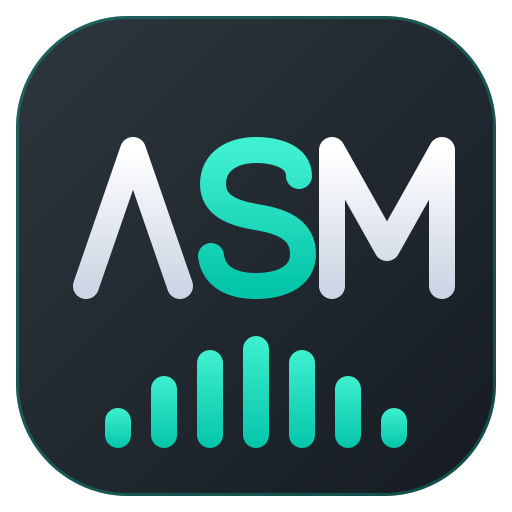

<p align="center">
  
</p>

# Arctis Sound Manager

**SteelSeries GG and Sonar are Windows-only.** Arctis Sound Manager is the Linux
application that replaces them: a parametric equalizer per channel, a
Game / Chat / Media / Output mixer, a working ChatMix dial, spatial audio, and
the headset's own settings — sidetone, ANC, inactivity timeout, battery, OLED.

It is built on PipeWire and speaks to the headset over its USB protocol, so it
needs neither Wine nor a vendor driver.

[Install](https://github.com/loteran/Arctis-Sound-Manager#installation) ·
[Latest release](https://github.com/loteran/Arctis-Sound-Manager/releases/latest) ·
[Source](https://github.com/loteran/Arctis-Sound-Manager) ·
[Discussions](https://github.com/loteran/Arctis-Sound-Manager/discussions)

## Install

```
curl -fsSL https://loteran.github.io/Arctis-Sound-Manager/install.sh | bash
```

Detects your distribution and installs the native package — Arch, Fedora,
Nobara, Debian, Ubuntu, Bazzite, SteamOS. Prefer running the commands yourself?
They are on the
[project page](https://github.com/loteran/Arctis-Sound-Manager#installation).

Check your model on the [supported devices](device_support.md) page first: every
headset is listed with its USB Product ID.

## What it replaces

- **[SteelSeries Sonar on Linux](steelseries-sonar-linux.md)** — what Sonar
  actually does, what is reproduced, and what is not.
- **[Arctis ChatMix on Linux](arctis-chatmix-linux.md)** — why the dial does
  nothing out of the box, and how it is made to work again.

## Documentation

- [Supported devices](device_support.md) — every supported headset, with its USB Product ID.
- [Video Clips](clips.md) — the opt-in screen recorder: installing it, removing it, and what
  its per-channel audio tracks are for.
- [Device configuration file specs](device_configuration_file_specs.md) — how a headset is described
  in YAML, and what it takes to add a new one.
- [D-Bus interface](dbus.md) — the daemon's D-Bus API, for scripting and integrations.
- [Hardware questions](HARDWARE-QUESTIONS.md) — what to capture when a headset is not yet supported.
- [Community stats](stats/) — which headsets and distributions people actually run ASM on.

## Community

- [ASM Presets](https://loteran.github.io/asm-presets/) — browse and share community EQ presets.
- [ASM Themes](https://loteran.github.io/asm-presets/#themes) — browse and share colour themes,
  previewed on a miniature of the app.
- [Discord](https://discord.gg/tbG4D5AnVz) — get help, share presets, report what works.
- [Crowdin](https://crowdin.com/project/arctis-sound-manager) — help translate ASM into your language.

Arctis Sound Manager is free software, released under the
[GPL-3.0](https://github.com/loteran/Arctis-Sound-Manager/blob/main/LICENSE).
